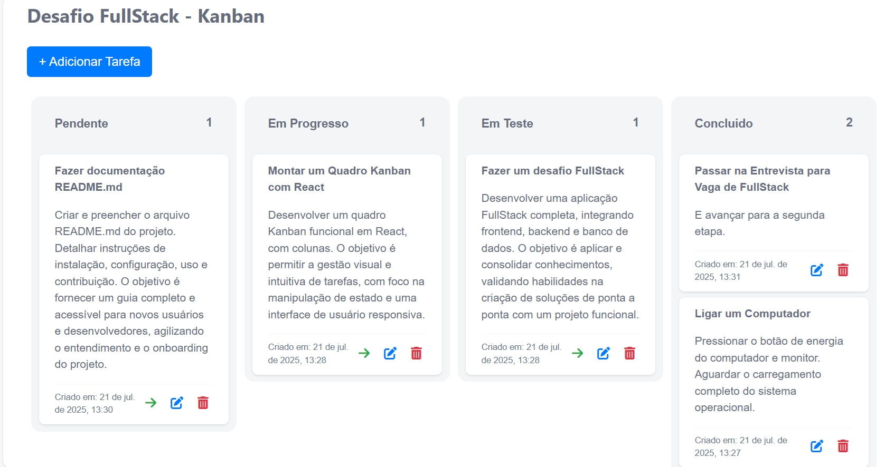

# Desafio Fullstack - Kanban Board



Aqui disponho orientações para a execução do projeto de quadro Kanban, dedicado para o Desafio FullStack, a aplicação está desenvolvida com NestJS no backend (Node.js com TypeScript) e ReactJS com Vite no frontend. 

- [Desafio Fullstack - Kanban Board](#desafio-fullstack---kanban-board)
  - [Tecnologias Utilizadas](#tecnologias-utilizadas)
  - [Funcionalidades](#funcionalidades)
  - [Pré-requisitos](#pré-requisitos)
  - [Configuração e Execução Local](#configuração-e-execução-local)
    - [1. Clonar o Repositório](#1-clonar-o-repositório)
    - [2. Criar banco de dados e usuário do banco](#2-criar-banco-de-dados-e-usuário-do-banco)
    - [3. Iniciar a aplicação](#3-iniciar-a-aplicação)
      - [Backend](#backend)
      - [Frontend](#frontend)
  - [Uso da IA](#uso-da-ia)
    - [Sugestão de Descrição para Tarefas:](#sugestão-de-descrição-para-tarefas)
    - [Análise de Sentimento de Comentários:](#análise-de-sentimento-de-comentários)
      - [A Chave API](#a-chave-api)
  - [Conclusão](#conclusão)

---

## Tecnologias Utilizadas

**Backend:**
* NestJS
* TypeScript
* PostgreSQL (Banco de Dados)
* TypeORM (ORM)
* Google Generative AI (Gemini 1.5 Flash) 

**Frontend:**
* ReactJS
* Vite
* Axios (Requisições HTTP)
* CSS para estilização

---

## Funcionalidades

**Backend (API REST):**
* Listar todas as tarefas
* Criar uma nova tarefa
* Editar uma tarefa
* Alterar o status da tarefa (pending, in_progress, testing, done)
* Deletar uma tarefa
* Sistema de comentários por tarefa (adicionar, listar por tarefa, remover)
* Análise de sentimento para comentários usando IA (positivo, negativo, neutro)
* Sugestão de descrição para tarefas usando IA

**Frontend (Interface Gráfica):**
* Exibir tarefas em colunas Kanban por status
* Formulários para criar e editar tarefas
* Exibição e interação com os comentários de cada tarefa.
* Funcionalidade de sugestão de descrição de tarefas via IA.

---

## Pré-requisitos

Apenas o básico e óbvio:

* Node.js com npm
* PostgreSQL
* Git

---

## Configuração e Execução Local

### 1. Clonar o Repositório

Vamos abrir nosso terminal e executar o comando:

```bash
git clone https://github.com/sfelipecarl36/desafio-fullstack

# Agora vamos para o diretório raiz do projeto com o comando cd
```

### 2. Criar banco de dados e usuário do banco

Antes de iniciarmos o projeto, vamos executar o script 'criarBD.sql' no terminal

```sh
psql -U postgres -f criarBD.sql
```

### 3. Iniciar a aplicação

#### Backend

Agora é rodar na raíz da pasta backend os comandos
```
npm install
npm run build
npm run start:dev
``` 
o Nest vai criar as tabelas automaticamente conforme fiz as entidades

Conforme padrão, o caminho será na porta `3000`

#### Frontend

Não podemos esquecer de instalar as dependências aqui também

Entremos na raíz da pasta frontend e então iniciamos a execução:

```
npm install
npm run dev
``` 

Porta padrão também `5173`

## Uso da IA

Nesse projeto utilizei a API do Gemini (Google Generative AI) para dois fins:

### Sugestão de Descrição para Tarefas: 

Criando uma nova tarefa, você pode clicar no botão "Sugerir Descrição" pra IA gerar uma descrição baseada no título fornecido.

### Análise de Sentimento de Comentários: 

Quando clicar para adicionar um comentário a uma tarefa, a IA analisa o conteúdo e classifica o sentimento como "positivo", "negativo" ou "neutro".

#### A Chave API

Reconheço como falha de segurança, mas abri uma excessão para arquivos .env no .gitignore na pasta backend, e deixei minha Chave da API do Gemini em exposição, apenas para facilitar tudo

## Conclusão

Conforme todo o conteúdo do README.md, é espero que a execução ocorra bem, fiz a divisão como solicitado no desafio: Uma pasta para frontend e outra para o projeto backend

Incrementei um sistema de comentários por tarefa mesmo sendo opcional, e utilizei IA com funcionalidades bem simplórias para demonstrar apenas um pequeno uso possível.

Espero um feedback positivo, mas acrescento que fazer esse pequeno Quadro Kanban foi desafiador por me fazer enfrentar diferentes frameworks e abordagens de banco de dados, é isso!